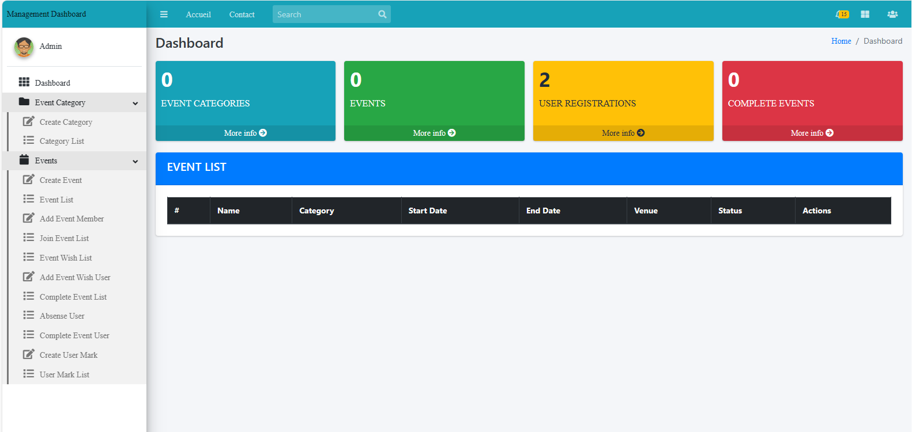
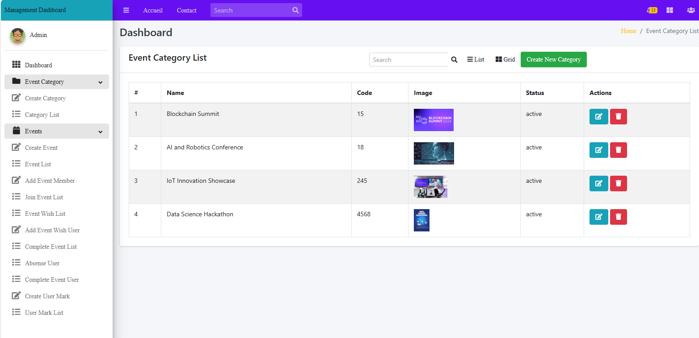

# SMWebPlanEvents

## Overview
SMWebPlanEvents is a web application built with Python and Django and JavaScript. It allows users to manage and organize events, including creating new events, registering attendees, and providing event details.

## Features
- Create new events with details such as title, date, time, and location.
- Register attendees for events.
- View and manage a list of registered attendees.
- Event details page with important information.

 ## Demo Screenshots

## Installation
1. Clone the repository:    git clone https://github.com/SaifeddineAlmissaoui/SMWebPlanEvents.git
2. Install the required dependencies: cd event-management  //  pip install -r requirements.txt
3. python manage.py migrate
4. python manage.py runserver
5. Open your web browser and go to http://localhost:8000 to access the application

   
